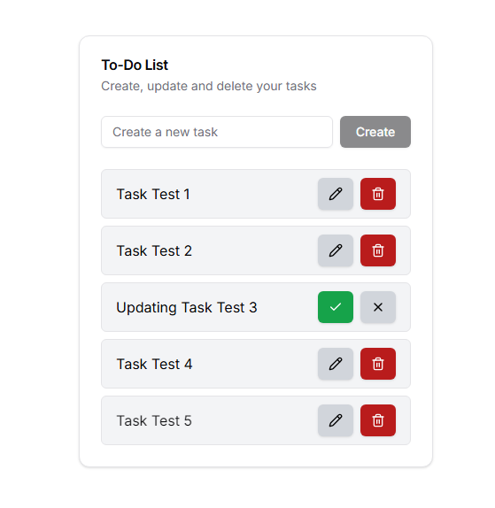

<h1>
   To-Do List
</h1>

<h1>
    
</h1>

## 🧾 Sobre

Ferramenta para organização de tarefas. Este app permite que o usuário crie suas listas de afazeres, podendo atualizá-las ou excluí-las conforme suas necessidades.

## 💻 Tecnologias utilizadas

- Next.js
- Tailwind CSS
- TypeScript
- shadcn/ui
- Lucide
- Axios
- TanStack Query
- json-server

## 🛠️ Como utilizar

Instale as dependências do projeto:

```bash
npm install
```

Inicie a API:

```bash
npm run server
```

Inicie o projeto:

```bash
npm run dev
```

Por fim, abra [http://localhost:3000](http://localhost:3000) em seu navegador.
